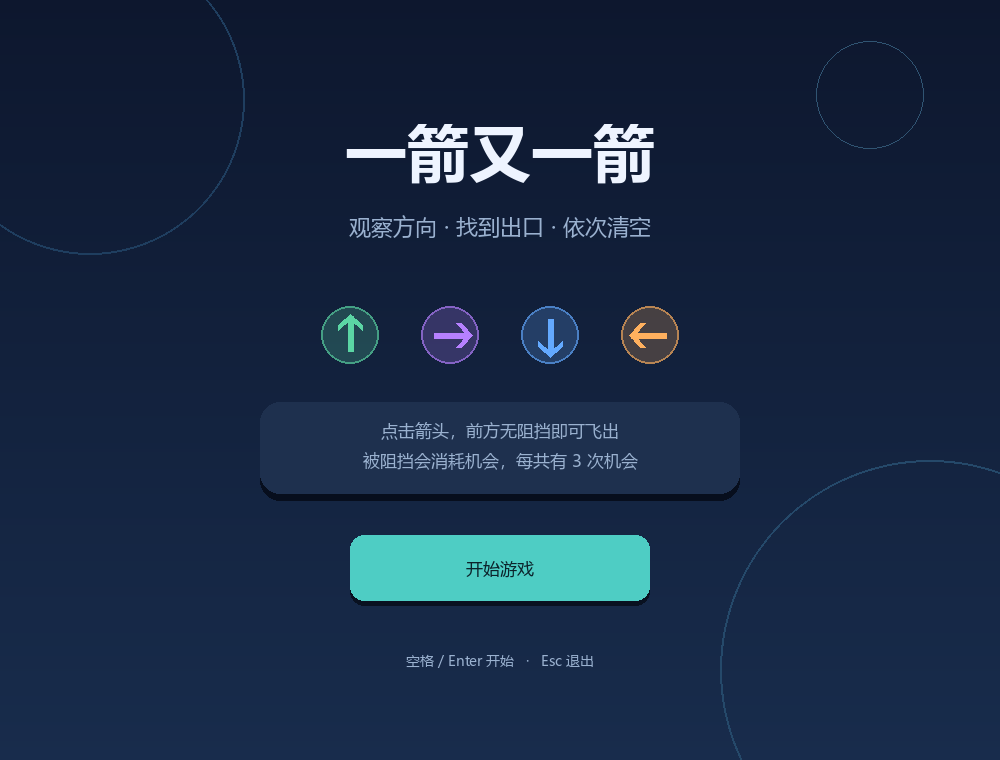
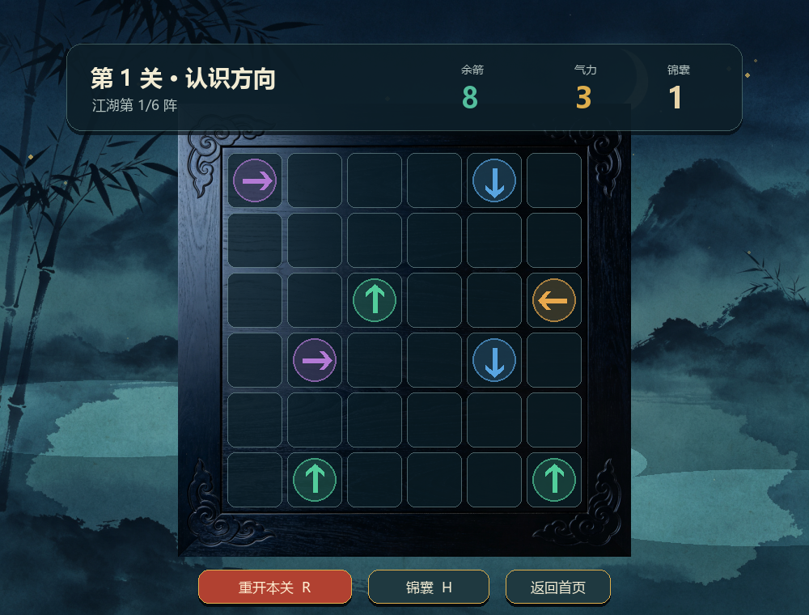
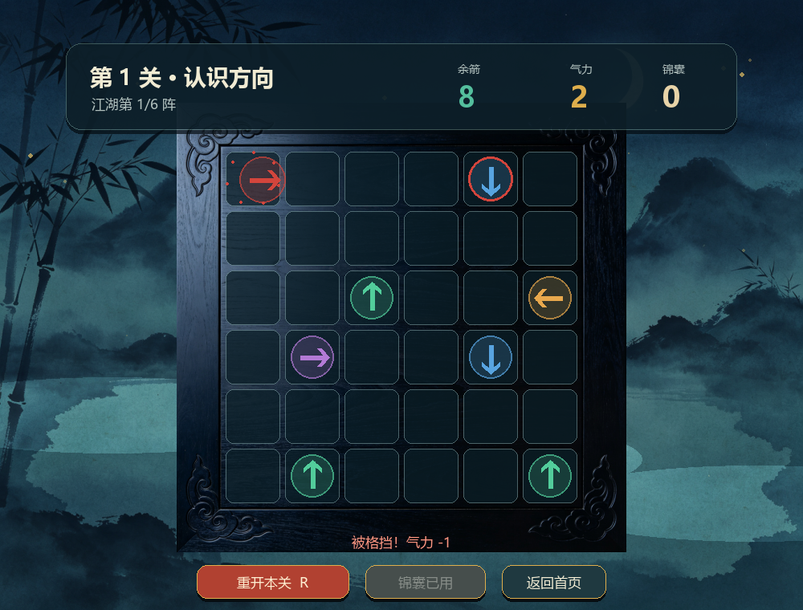
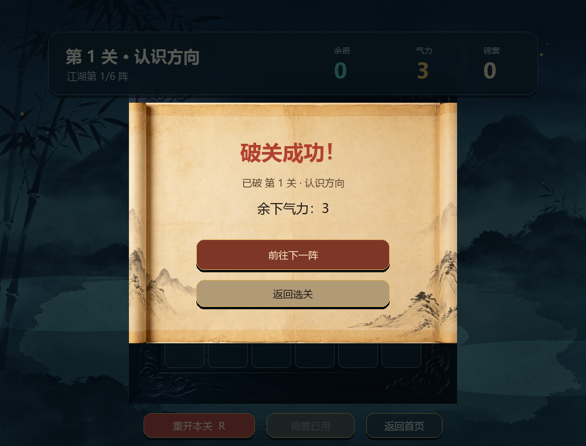

# 一箭又一箭

一个使用 Python 和 Pygame 完成的点击式箭头解谜游戏。玩家需要观察箭头方向和相互阻挡关系，按合理顺序清空棋盘。

## 游戏规则

- 箭头只有上、下、左、右四个方向。
- 如果箭头到棋盘边界的前进路径上没有其他箭头，它会飞出棋盘并消失。
- 如果前方存在箭头，它会被阻挡，播放碰撞反馈并消耗一次失误机会。
- 每关有 2–3 点气力；清空棋盘即通关，气力耗尽则失败。
- 每次挑战可以使用一次“锦囊”，高亮当前可安全飞出的箭头。

## 环境与运行

建议使用 Python 3.10 或更高版本。

```bash
python -m pip install -r requirements.txt
python main.py
```

Windows 上如果 `python` 指向了其他 Conda 环境，可明确使用已安装
Pygame 的 Python 3.13：

```powershell
py -3.13 -m pip install -r requirements.txt
py -3.13 main.py
```

## 运行测试

```bash
python -m pytest
```

Windows 对应命令为 `py -3.13 -m pytest`。

## 项目结构

```text
.
├── main.py                    # 游戏入口
├── game_logic.py              # 棋盘规则和游戏状态
├── levels.py                  # 六个固定关卡
├── save_manager.py            # 关卡解锁进度存档
├── ui.py                      # 武侠主题界面、交互和动画
├── tests/                     # 自动化测试
├── tools/capture_screenshots.py
├── assets/wuxia/              # 水墨背景、木纹棋盘和卷轴
├── assets/screenshots/        # 博客展示图
└── docs/                      # 验收、AIGC 记录和博客草稿
```

## 交付说明

游戏进度会写入项目目录下的 `save.json`，该文件不会提交到 Git。完整的作业博客 Markdown 草稿见 `docs/blog.md`，发布到博客园前需要重新上传其中的本地截图。

## 界面预览

| 开始界面 | 游戏界面 |
| --- | --- |
|  |  |

| 碰撞反馈 | 通关界面 |
| --- | --- |
|  |  |
