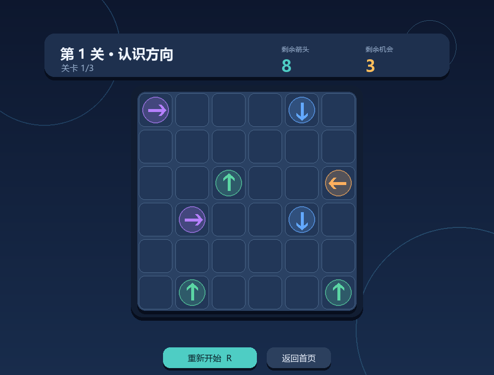
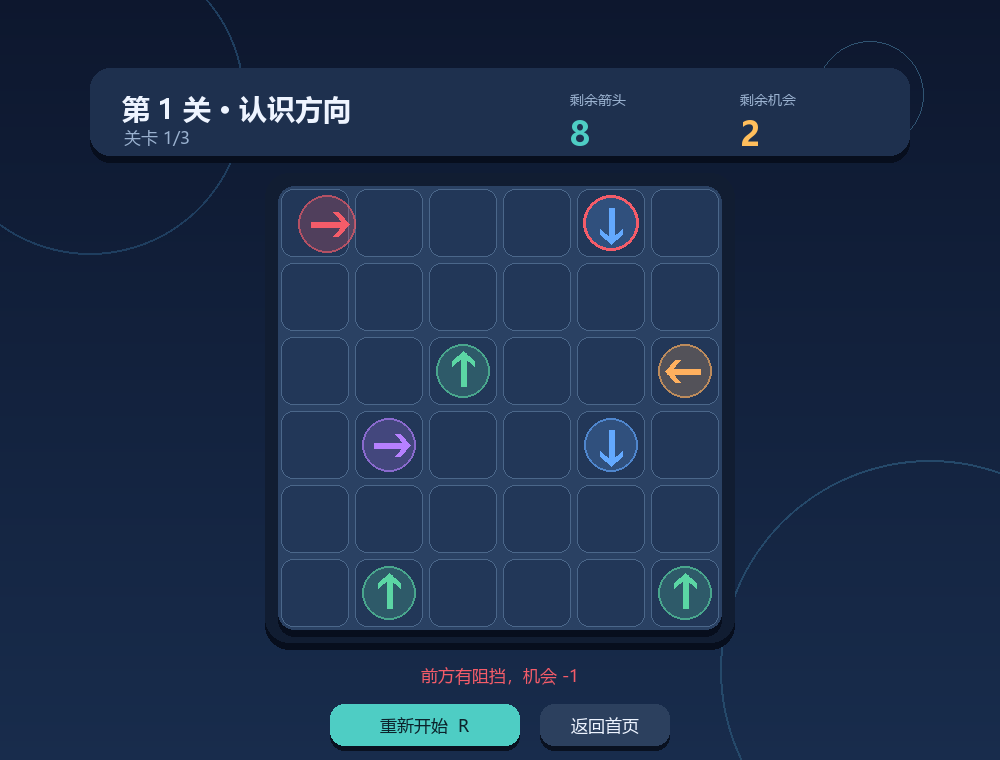
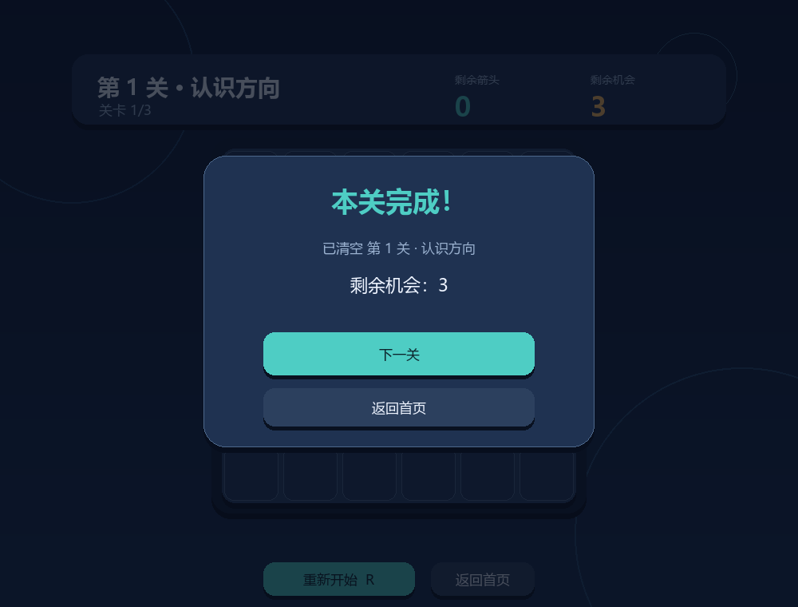
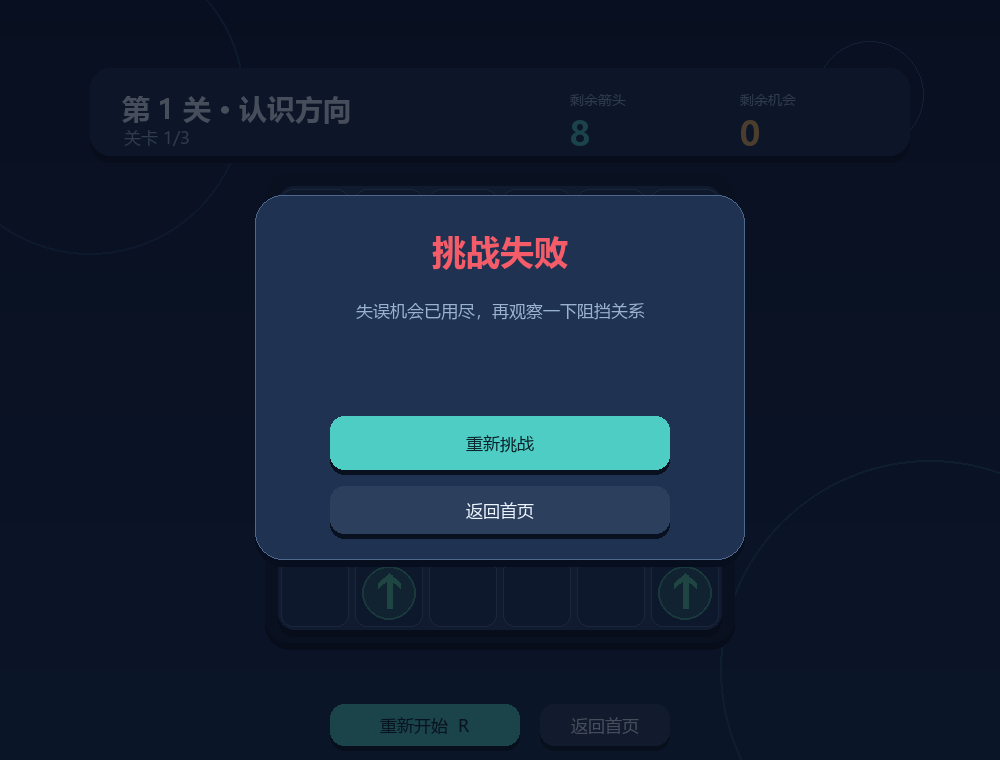
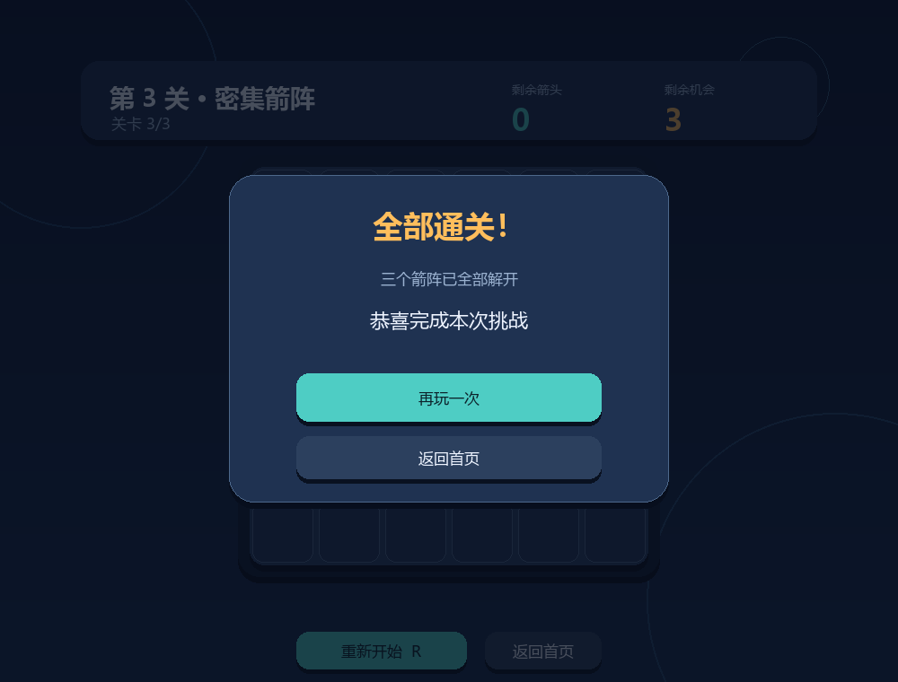

# 2026 秋软件工程个人作业（第二次）——《一箭又一箭》

| 项目 | 内容 |
| --- | --- |
| 这个作业属于哪个课程 | [H202601 软件工程与软件工程实践](https://edu.cnblogs.com/campus/fzu/2026-01SoftwareEngineeringandSoftwareEngineeringPractice) |
| 这个作业要求在哪里 | [2026 秋软件工程个人作业（第二次）](https://edu.cnblogs.com/campus/fzu/2026-01SoftwareEngineeringandSoftwareEngineeringPractice/homework/16718) |
| 这个作业的目标 | 使用 Python 和 AIGC 完成“一箭又一箭”小游戏 |
| 学号 | **请填写** |
| GitHub 仓库 | **请在推送后填写** |

> 发布前请先删除所有“请填写”提示，将图片上传到博客园后替换本地相对路径，并根据本人实际试玩填写人工测试和心得。

## 一、项目展示

本项目使用 Python 3.13 和 Pygame 2.6.1 完成。界面图形均使用 Pygame API 绘制，不依赖外部图片素材。

### 1. 开始界面


### 2. 游戏界面



顶部 HUD 显示当前关卡、剩余箭头数和剩余机会；底部可以重新开始或返回首页。

### 3. 碰撞反馈



点击被阻挡的箭头时，箭头会向前移动、变红并晃动，最近阻挡者周围出现红色提示圈，同时剩余机会减一。

### 4. 通关与失败界面

| 通关 | 失败 |
| --- | --- |
|  |  |

### 5. 全部通关



## 二、项目介绍

### 1. 游戏规则

- 6×6 棋盘中放置上、下、左、右四种箭头。
- 点击箭头后，程序检查其前进方向到棋盘边界之间是否存在其他箭头。
- 没有阻挡时，箭头播放飞出动画并从棋盘消失。
- 存在阻挡时，箭头不消失，播放碰撞动画并消耗一次机会。
- 每共有 3 次机会；清空本关箭头即通关，机会耗尽则失败。

### 2. 项目功能

- 开始、游戏、通关、失败和全部通关的完整流程。
- 三个固定关卡，均通过求解器验证可以通关。
- 箭头飞出、碰撞前移、变红、晃动和阻挡者高亮。
- 剩余箭头和失误机会实时更新。
- 按 R 或点击按钮重新开始当前关卡，Esc 返回首页。

## 三、实现思路

### 1. 逻辑层与界面层分离

`game_logic.py` 只负责棋盘规则、机会、胜负状态和可解性检查，不依赖 Pygame。`ui.py` 只负责绘制、鼠标事件和动画。这样核心规则可以在不打开窗口的情况下独立测试。

### 2. 方向与路径判断

方向统一表示为行列增量：

```python
DIRECTION_STEPS = {
    "U": (-1, 0),
    "D": (1, 0),
    "L": (0, -1),
    "R": (0, 1),
}
```

点击箭头后，从前方第一格开始沿方向逐格检查。只有坐标仍在棋盘内时才访问数组，避免向上或向左时出现 Python 负下标问题。

```python
while in_bounds(board, next_row, next_col):
    if board[next_row][next_col] is not None:
        return next_row, next_col
    next_row += row_step
    next_col += col_step
return None
```

### 3. 判定与动画的顺序

成功点击后，箭头立即从逻辑棋盘中移除，界面层使用单独的动画快照播放飞出效果。这能避免“箭头看起来已经飞走，但仍在阻挡后方箭头”的状态不一致问题。动画期间忽略新点击，防止连点导致重复扣除机会。

### 4. 关卡可解性

`solve_board()` 不断寻找当前可以飞出的箭头并模拟移除：如果最后能清空棋盘，就返回一个通关顺序；如果棋盘仍有箭头但无箭可移，则该关卡存在死锁。

开发中第 2 关初稿的测试结果为 `12 passed, 1 failed`。检查发现多个箭头形成了环形阻挡链。将其中一个边缘箭头调整为朝棋盘外后，三关全部通过可解性测试。

## 四、AIGC 使用过程

| 子任务 | 使用的 AIGC | AI 提供的内容 | 实际效果 | 人工判断与修改 |
| --- | --- | --- | --- | --- |
| 需求分析 | ChatGPT / Codex | 整理作业必做功能、测试项和博客结构 | 形成分阶段计划 | 本人确定先完成基础闭环，暂不贪多扩展功能 |
| 核心规则 | Codex | 设计逻辑层、路径判断、游戏状态和 T01–T06 测试 | 第一轮测试发现第 2 关死锁 | 根据阻挡坐标修改关卡中一个箭头方向，再次测试通过 |
| Pygame 界面 | Codex | 实现页面、HUD、按钮、飞出和碰撞动画 | 初版因 Pygame 字体枚举问题崩溃 | 避开 `SysFont/match_font`，改为从系统字体目录直接加载中文字体 |
| 自动验收 | Codex | 编写逻辑测试、无窗口界面测试和截图脚本 | 16 项测试全部通过，生成 6 张界面截图 | 已检查中文、按钮、棋盘和 HUD 布局；本人实际试玩待补充 |

> 可在这里追加与 AIGC 对话的真实截图，但不要补造没有发生过的提问或修改。

## 五、测试结果

运行命令：

```powershell
py -3.13 -m pytest -q
```

自动化结果：`16 passed`。

| 编号 | 测试内容 | 预期结果 | 自动测试 | 本人试玩 |
| --- | --- | --- | --- | --- |
| T01 | 点击前方无阻挡的箭头 | 箭头飞出并消失，剩余数减一 | 通过 | **请填写** |
| T02 | 点击前方有阻挡的箭头 | 箭头保留，机会减一 | 通过 | **请填写** |
| T03 | 点击边缘且朝向棋盘外的箭头 | 四个方向均正常消失，不越界 | 通过 | **请填写** |
| T04 | 消除本关全部箭头 | 显示通关并进入下一关 | 通过 | **请填写** |
| T05 | 失误机会耗尽 | 显示失败并可重新挑战 | 通过 | **请填写** |
| T06 | 游戏进行中重新开始 | 布局、数量和机会全部恢复 | 通过 | **请填写** |

此外，自动化测试还覆盖了三个关卡的通关顺序重放、空格点击、五个主要页面的无窗口渲染和重开按钮。

## 六、Git 版本管理

本项目按开发阶段保留提交，而不是在最后一次性上传：

```text
chore: scaffold project and acceptance records
feat: implement arrow puzzle rules and solvable levels
feat: add pygame interface animations and screenshots
docs: add report draft and manual verification guide
```

## 七、PSP 表格

> 下表必须换成本人的真实记录。如果开发前没有确认预估时间，不要将 AI 提供的数字写成本人原始预估。

| 任务 | 预估耗时（小时） | 实际耗时（小时） | 差异 |
| --- | ---: | ---: | ---: |
| 需求分析与游戏设计 | 请填写 | 请填写 | 请填写 |
| Python 与 Pygame 学习 | 请填写 | 请填写 | 请填写 |
| 核心规则与路径判断 | 请填写 | 请填写 | 请填写 |
| 游戏界面与动画 | 请填写 | 请填写 | 请填写 |
| 关卡设计与可解性检查 | 请填写 | 请填写 | 请填写 |
| AIGC 沟通、阅读与修改 | 请填写 | 请填写 | 请填写 |
| 测试、试玩与问题修复 | 请填写 | 请填写 | 请填写 |
| README、截图与博客整理 | 请填写 | 请填写 | 请填写 |
| **合计** | **请填写** | **请填写** | **请填写** |

## 八、心得体会

> 这一节应体现本人的真实理解。请在试玩和阅读核心代码后，围绕以下问题写成连贯段落：

1. 开发前对这个游戏的预期，与实际遇到的难点有什么差异？
2. 为什么要先判断边界再访问棋盘？
3. 第 2 关死锁和 Windows 字体问题说明了 AIGC 输出的哪些风险？
4. 自动化测试与本人试玩分别发现了什么？
5. 下次与 AIGC 协作时，会如何更准确地描述需求和验收结果？

**请将本人心得写在这里，不要原样保留以上提示。**

## 九、素材与安全说明

- 本项目只参考箭头解谜类游戏的基础玩法，没有复制商业游戏的代码、素材或关卡。
- 箭头、按钮、棋盘和背景均由 Pygame 程序化绘制。
- 仓库中不包含密码、Cookie、API Key 或 Token。

