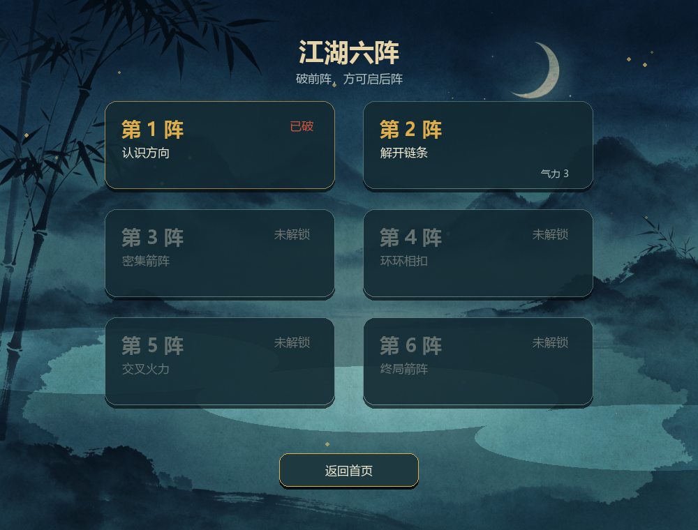
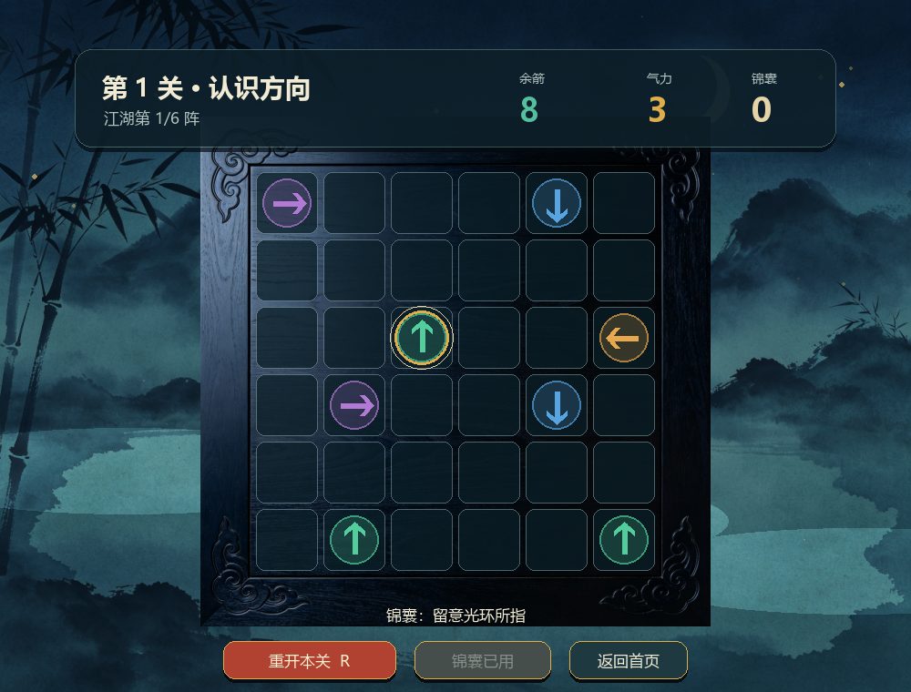
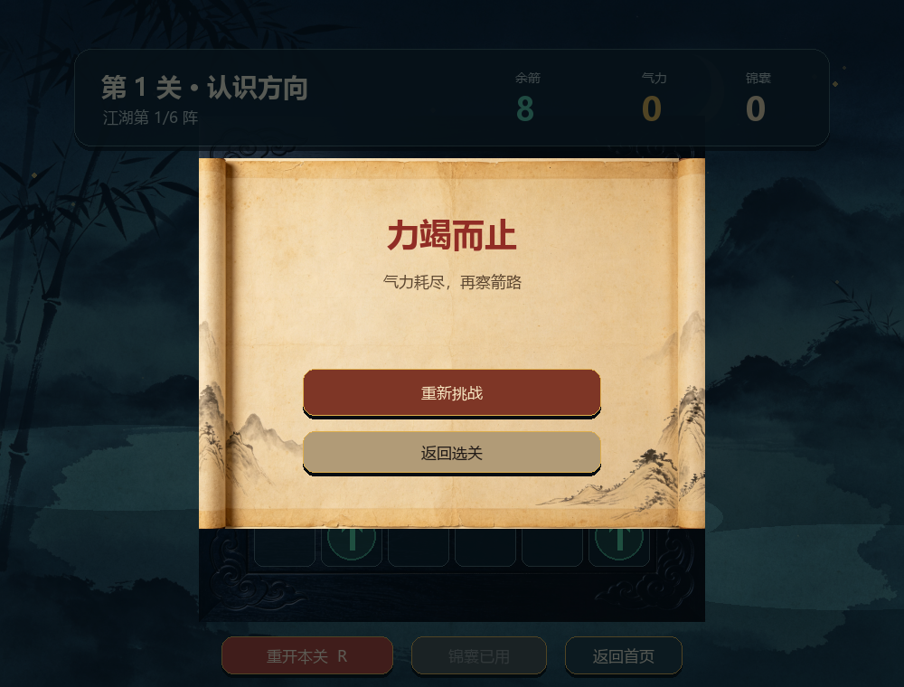
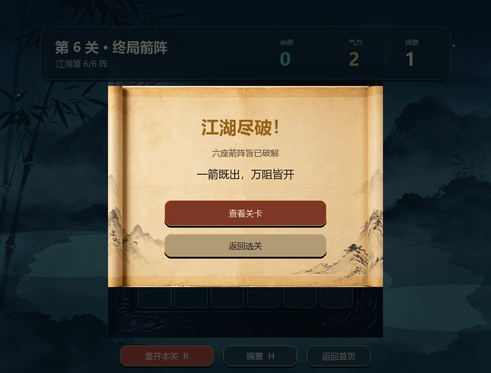

# 2026 秋软件工程个人作业（第二次）——《一箭又一箭》：以代码布阵，以测试破局

| 项目 | 内容 |
| --- | --- |
| 这个作业属于哪个课程 | [H202601 软件工程与软件工程实践](https://edu.cnblogs.com/campus/fzu/2026-01SoftwareEngineeringandSoftwareEngineeringPractice) |
| 这个作业要求在哪里 | [2026 秋软件工程个人作业（第二次）](https://edu.cnblogs.com/campus/fzu/2026-01SoftwareEngineeringandSoftwareEngineeringPractice/homework/16718) |
| 这个作业的目标 | 使用 Python 和 AIGC 完成“一箭又一箭”小游戏 |
| 学号 | 102401221 |
| GitHub 仓库 | [Coderbrain404/OneArrowGame](https://github.com/coderbrain404/OneArrowGame) |

> 发布到博客园前，需要上传文中的项目截图，并将本地相对路径替换为博客园图片地址。

## 一、初见江湖：项目展示

本项目使用 Python 3.13 和 Pygame 2.6.1 完成。玩家以观察为剑、以顺序为招，逐步破解六座箭阵。界面采用水墨武侠主题，并保留程序化绘制的箭头、光环、雾气和粒子动画；视觉表达可以有江湖气，游戏规则与实现说明则始终以准确、可验证为先。

### 1. 开始界面


### 2. 游戏界面


顶部 HUD 显示当前关卡、余箭、气力和锦囊；底部可以重开、使用提示或返回首页。

### 3. 关卡选择与提示

| 关卡选择 | 锦囊提示 |
| --- | --- |
|  |  |

### 4. 碰撞反馈


点击被阻挡的箭头时，箭头会向前移动、变红并晃动，同时出现朱砂粒子与阻挡者提示圈，气力减一。

### 5. 通关与失败界面

| 通关 | 失败 |
| --- | --- |
|  |  |

### 6. 全部通关



## 二、规则立界：项目介绍

### 1. 游戏规则

- 6×6 棋盘中放置上、下、左、右四种箭头。
- 点击箭头后，程序检查其前进方向到棋盘边界之间是否存在其他箭头。
- 没有阻挡时，箭头播放飞出动画并从棋盘消失。
- 存在阻挡时，箭头不消失，播放碰撞动画并消耗一次机会。
- 每关有 2–3 点气力；清空本关箭头即通关，气力耗尽则失败。

### 2. 项目功能

- 开始、选关、游戏、通关、失败和全部通关的完整流程。
- 六个固定关卡，均通过求解器验证可以通关。
- 按通关进度逐关解锁，并通过 JSON 存档保留进度。
- 每次挑战可使用一次锦囊，高亮当前可安全飞出的箭头。
- 飞出残影、碰撞粒子、箭头入场、提示呼吸光环和卷轴淡入动画。
- 按 R 重开当前关卡，按 H 使用锦囊，Esc 返回首页。

## 三、代码布阵：实现思路

### 1. 逻辑层与界面层分离

`game_logic.py` 只负责棋盘规则、机会、胜负状态和可解性检查，不依赖 Pygame。`ui.py` 只负责绘制、鼠标事件和动画。这样核心规则可以在不打开窗口的情况下独立测试。

### 2. 方向与路径判断

方向统一表示为行列增量：

```python
DIRECTION_STEPS = {
    "U": (-1, 0),
    "D": (1, 0),
    "L": (0, -1),
    "R": (0, 1),
}
```

点击箭头后，从前方第一格开始沿方向逐格检查。只有坐标仍在棋盘内时才访问数组，避免向上或向左时出现 Python 负下标问题。

```python
while in_bounds(board, next_row, next_col):
    if board[next_row][next_col] is not None:
        return next_row, next_col
    next_row += row_step
    next_col += col_step
return None
```

### 3. 判定与动画的顺序

成功点击后，箭头立即从逻辑棋盘中移除，界面层使用单独的动画快照播放飞出效果。这能避免“箭头看起来已经飞走，但仍在阻挡后方箭头”的状态不一致问题。动画期间忽略新点击，防止连点导致重复扣除机会。

### 4. 关卡可解性：布阵必有解

`solve_board()` 不断寻找当前可以飞出的箭头并模拟移除：如果最后能清空棋盘，就返回一个通关顺序；如果棋盘仍有箭头但无箭可移，则该关卡存在死锁。

开发中第 2 关初稿的测试结果为 `12 passed, 1 failed`。检查发现多个箭头形成了环形阻挡链。将其中一个边缘箭头调整为朝棋盘外后，原有三关全部通过可解性测试；后续新增的第 4–6 关也分别通过了解法重放。

## 四、人机同行：AIGC 使用过程

AIGC 提供思路与实现草案，人工负责判断取舍、运行测试和确认最终效果。它更像同行参谋，而不是替代开发者作出所有决定。

| 子任务 | 使用的 AIGC | AI 提供的内容 | 实际效果 | 人工判断与修改 |
| --- | --- | --- | --- | --- |
| 需求分析 | ChatGPT / Codex | 整理作业必做功能、测试项和博客结构 | 形成分阶段计划 | 本人确定先完成基础闭环，暂不贪多扩展功能 |
| 核心规则 | Codex | 设计逻辑层、路径判断、游戏状态和 T01–T06 测试 | 第一轮测试发现第 2 关死锁 | 根据阻挡坐标修改关卡中一个箭头方向，再次测试通过 |
| Pygame 界面 | Codex | 实现页面、HUD、按钮、飞出和碰撞动画 | 初版因 Pygame 字体枚举问题崩溃 | 避开 `SysFont/match_font`，改为从系统字体目录直接加载中文字体 |
| 自动验收 | Codex | 编写逻辑、存档、选关和无窗口界面测试及截图脚本 | 26 项测试全部通过，生成 8 张新版界面截图 | 已检查中文、按钮、棋盘和 HUD 布局，并完成两轮人工试玩 |
| 二次优化 | 豆包建议文档 + Codex | 评估第 4–6 关与扩展建议，加入武侠风格 | 采纳六关、选关、提示、存档和动画；暂缓计分、撤销、星级和音效 | 标题图片无透明通道，未直接使用；第 6 关按设计保留 2 点气力 |

> 可在这里追加与 AIGC 对话的真实截图，但不要补造没有发生过的提问或修改。

## 五、逐阵验招：测试结果

运行命令：

```powershell
py -3.13 -m pytest -q
```

自动化结果：`26 passed`。

| 编号 | 测试内容 | 预期结果 | 自动测试 | 本人试玩 |
| --- | --- | --- | --- | --- |
| T01 | 点击前方无阻挡的箭头 | 箭头飞出并消失，剩余数减一 | 通过 | 通过 |
| T02 | 点击前方有阻挡的箭头 | 箭头保留，机会减一 | 通过 | 通过 |
| T03 | 点击边缘且朝向棋盘外的箭头 | 四个方向均正常消失，不越界 | 通过 | 通过 |
| T04 | 消除本关全部箭头 | 显示通关并进入下一关 | 通过 | 通过 |
| T05 | 失误机会耗尽 | 显示失败并可重新挑战 | 通过 | 通过 |
| T06 | 游戏进行中重新开始 | 布局、数量和机会全部恢复 | 通过 | 通过 |

此外，自动化测试还覆盖了六关通关顺序重放、合法提示、指定关卡加载、损坏存档回退、选关锁定、提示次数、六个主要页面的无窗口渲染和重开按钮。

## 六、改动留痕：Git 版本管理

代码如同招式，需要知道每一步从何而来。本项目按开发阶段保留 Git 提交，而不是在最后一次性上传：

```text
chore: scaffold project and acceptance records
feat: implement arrow puzzle rules and solvable levels
feat: add pygame interface animations and screenshots
docs: add report draft and manual verification guide
feat: add six-level wuxia challenge
```

## 七、计时复盘：PSP 表格

> 开发过程中没有持续使用计时工具，所以下表是开发结束后根据各阶段经历进行的回忆估算，不是实时计时数据。

| 任务 | 预估耗时（小时） | 实际耗时（小时） | 差异 |
| --- | ---: | ---: | ---: |
| 需求分析与游戏设计 | 0.8 | 1.0 | +0.2 |
| Python 与 Pygame 学习 | 1.2 | 1.5 | +0.3 |
| 核心规则与路径判断 | 1.5 | 1.3 | -0.2 |
| 游戏界面与动画 | 2.0 | 2.5 | +0.5 |
| 关卡设计与可解性检查 | 1.0 | 1.2 | +0.2 |
| AIGC 沟通、阅读与修改 | 1.0 | 1.2 | +0.2 |
| 测试、试玩与问题修复 | 1.0 | 1.3 | +0.3 |
| README、截图与博客整理 | 0.8 | 1.0 | +0.2 |
| **合计** | **9.3** | **11.0** | **+1.7** |

## 八、行至此处：心得体会

第一次试玩是在 2026 年 9 月 18 日，当时游戏只有三个基础关卡，我大约用 1 分钟就完成了全部关卡。虽然点击、阻挡、通关和失败流程已经能够正常运行，但实际玩下来，我感觉界面比较单一，关卡数量也偏少，整体难度较低，很快就失去了继续挑战的动力。

在第一次试玩之后，我开始考虑怎样让项目不仅满足基本要求，还能形成更完整的游戏体验。相比单纯增加箭头数量，我认为先建立统一的视觉主题会更加直观，因此选择了水墨武侠风格，并加入水墨月夜背景、木纹棋盘、宣纸卷轴、武侠化文案和动画效果。同时，我把关卡数量从三个扩展到六个，并加入关卡选择、逐关解锁、提示和进度存档等功能。

2026 年 9 月 21 日，我对优化后的版本进行了第二次完整试玩，六关通关大约用了 3 分钟。和初版相比，新关卡中的箭头数量更多，阻挡关系也更加密集，确实需要花更多时间观察，但总体上依然比较简单。我认为这不完全是关卡设计的问题，而是基础规则本身决定的：箭头成功移除以后只会减少阻挡，不会产生新的障碍，因此局面通常会越来越简单。只增加箭头数量可以延长观察时间，却很难从根本上提高策略深度。

如果以后继续完善，我希望加入墙格、只能按特定顺序解除的机关箭头、限步挑战、倒计时或者不同类型的箭矢，让玩家不仅需要判断当前能否飞出，还要考虑后续局面的变化。这样才能让游戏从单纯的观察判断发展为更有策略性的解谜玩法。

我原本还希望加入江湖风格的背景音乐和音效，让武侠主题更加完整。但为了避免使用来源不明确或存在版权问题的外部音频素材，本次暂时没有加入音乐，这一点比较遗憾。以后如果能够使用自己制作或明确允许使用的音频素材，可以继续补充箭矢破空、被格挡和通关等声音反馈。

这次开发也让我认识到，AIGC 可以快速提供代码、关卡和界面建议，但它给出的结果不能直接照搬。例如，早期关卡曾出现相互阻挡造成的死锁，标题图片也存在没有透明通道的问题，都需要通过自动测试、截图检查和实际试玩才能发现。相比单纯让 AI 生成更多功能，我认为更重要的是明确需求、判断建议是否合理，并用测试验证最终结果。

## 九、来路清楚：素材与安全说明

- 本项目只参考箭头解谜类游戏的基础玩法，没有复制商业游戏的代码、素材或关卡。
- 箭头和动态效果由 Pygame 程序化绘制；水墨背景、木纹棋盘和卷轴使用项目内的武侠主题图片素材。
- 仓库中不包含密码、Cookie、API Key 或 Token。
